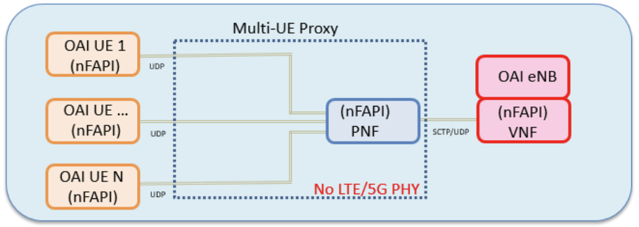
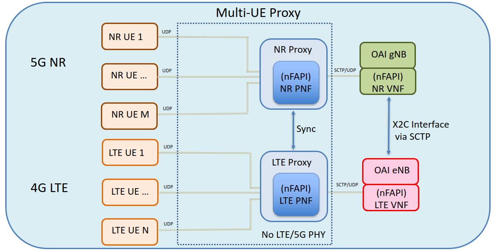

# Description #

This repository contains the Multi-UE Proxy to allow UEs to communicate with a single eNB (aka, lte mode), a single gNB (aka, nr mode), or both of them (aka, nsa mode) using the customzied OpenAir Interface (OAI) software.
The OAI code is located at https://gitlab.eurecom.fr/oai/openairinterface5g.
The UEs communicate to the eNB via the bypass PHY layer.
Various multi-UE scenarios can be tested without the overhead of a PHY layer.
This proxy currently requires EpiSci's modified version of the OAI repo available at: https://github.com/EpiSci/openairinterface5G.

The LTE mode functional description of this multi-UE proxy is shown in the following image:



The NSA mode functional description of this multi-UE proxy is shown in the following image:



## Included Features ##

The multi-UE proxy includes the following:

- Socket communciation from/to UE(s)
- Socket communication from/to eNB
- Socket communciation from/to nrUE(s)
- Socket communication from/to gNB
- LTE Proxy mode and NSA Proxy mode
- Uplink/downlink packet queueing
- nFAPI compatibility
- Logging mechanism
- Test scripts

## Prerequsites ##

Build and install the EpiSys version of the OAI repository.
In the following, we assume that the packages were installed in home folder.

1. Open a terminal and clone [openairinterface5g](https://gitlab.eurecom.fr/oai/openairinterface5g.git) repo.
2. git checkout episys-merge-nsa
3. Open a terminal and clone [oai-lte-multi-ue-proxy](https://github.com/EpiSci/oai-lte-multi-ue-proxy.git) repo.
4. git checkout master
5. If you run proxy in loopback mode, add the following loopback interface for VNF in gNB as following.

```shell
sudo ifconfig lo: 127.0.0.2 netmask 255.0.0.0 up
```


## Build the proxy ##

```shell
cd ~/oai-lte-multi-ue-proxy
make
```

## Run the proxy with script ##

```shell
NUMBER_OF_UES=1
./proxy_testscript.py -u $NUMBER_OF_UES --mode=nsa
```

See `./proxy_testscript.py --help` for more information.


## Run the proxy without script ##

The following is launching order for network elements (eNB, gNB, Proxy, nrUE, and UE).

1. Open a terminal and launch eNB

```shell
cd ~/openairinterface5g
source oaienv
cd cmake_targets
sudo -E ./ran_build/build/lte-softmodem -O ../ci-scripts/conf_files/proxy_rcc.band7.tm1.nfapi.conf --noS1 --nsa | tee eNB.log 2>&1
```

2. Open a terminal and launch gNB

```shell
cd ~/openairinterface5g
source oaienv
cd cmake_targets
sudo -E ./ran_build/build/nr-softmodem -O ../targets/PROJECTS/GENERIC-LTE-EPC/CONF/proxy_rcc.band78.tm1.106PRB.nfapi.conf --nfapi 2 --noS1 --nsa | tee gNB.log 2>&1
```

3. Open a terminal and launch proxy

NUMBER_OF_UES is the total number of UEs.

```shell
cd ~/oai-lte-multi-ue-proxy
NUMBER_OF_UES=1
sudo -E ./build/proxy $NUMBER_OF_UES --nsa enb_ipaddr gnb_ipaddr proxy_ipaddr ue_ipaddr
```

If you do not specify the parameters ending with ipaddr, the default IP addresses are the following.
enb_ipaddr = 127.0.0.1
gnb_ipaddr = 127.0.0.2
proxy_ipaddr = 127.0.0.1
ue_ipaddr = 127.0.0.1

4. Open a terminal and launch nrUE

nrUE NODE_ID starts from 2 from the first nrUE. If you run one more nrUE, the next NODE_ID = 3 in additional terminal.

```shell
cd ~/openairinterface5g
source oaienv
cd cmake_targets
NODE_ID=2
sudo -E ./ran_build/build/nr-uesoftmodem -O ../ci-scripts/conf_files/proxy_nr-ue.nfapi.conf --nokrnmod 1 --noS1 --nfapi 5 --node-number $NODE_ID --nsa | tee nrue_$NODE_ID.log 2>&1
```

5. Open a terminal and launch UE

UE NODE_ID starts from 2 from the first UE. If you run one more UE, the next NODE_ID = 3 in additional terminal.

```shell
cd ~/openairinterface5g
source oaienv
cd cmake_targets
NODE_ID=2
sudo -E ./ran_build/build/lte-uesoftmodem -O ../ci-scripts/conf_files/proxy_ue.nfapi.conf --L2-emul 5 --nokrnmod 1 --noS1 --num-ues 1 --node-number $NODE_ID --nsa | tee ue_$NODE_ID.log 2>&1
```

6. Checking log result

After running the programs for 30 seconds or more, stop the processes using Ctrl-C.
Open the log files and check the following logs to verify the run results.

- gNB.log : search for "CFRA procedure succeeded" logs for the number of UE times together with the unique rnti value.
- eNB.log : search for "Sent rrcReconfigurationComplete to gNB" one time.
- nrue_1.log : search for "Found RAR with the intended RAPID" one time.
- ue_1.log : search for "Sent RRC_CONFIG_COMPLETE_REQ to the NR UE" one time.

The following is an example of how to search for a particular log in the generated log file.

```shell
cat gNB.log | grep -n 'CFRA procedure succeeded'
```

For the further detailed information, refer to log section of the proxy_testscript.py script.
