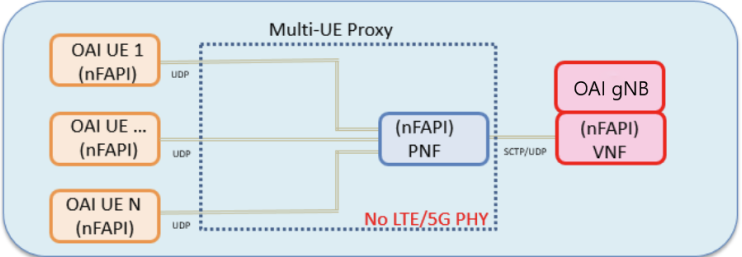

# Description #

This repository contains the Multi-UE Proxy to allow UEs to communicate with a
single eNB (LTE mode), or both an eNB and gNB (NSA mode), or a single gNB
(SA/NR mode) using the customized OpenAirInterface (OAI) software. The OAI
code is located at <https://gitlab.eurecom.fr/oai/openairinterface5g>. The UEs
communicate to the eNB via the bypass PHY layer. Various multi-UE scenarios
can be tested without the overhead of a PHY layer.

The LTE mode functional description of this multi-UE proxy is shown in the
following image:


The NSA mode functional description of this multi-UE proxy is shown in the following image:


The SA mode functional description of this multi-UE proxy is shown in the following image:



## Included Features ##

The multi-UE proxy includes the following:

- Socket communciation from/to UE(s)
- Socket communication from/to eNB
- Socket communciation from/to nrUE(s)
- Socket communication from/to gNB
- LTE Proxy mode and NSA Proxy mode
- Uplink/downlink packet queueing
- nFAPI compatibility
- Logging mechanism
- Test scripts

## Prerequsites ##

Build and install the EpiSys version of the OAI repository.

1. Open a terminal and clone [openairinterface5g](https://gitlab.eurecom.fr/oai/openairinterface5g.git) repo.
2. git checkout develop
3. Open a terminal and clone [oai-lte-multi-ue-proxy](https://github.com/EpiSci/oai-lte-multi-ue-proxy.git) repo.
4. git checkout master
5. If you run the proxy in loopback mode, add the following loopback interface for the VNF in the gNB.

    ```shell
    sudo ifconfig lo: 127.0.0.2 netmask 255.0.0.0 up
    ```

6. Verify that SCTP support is enabled.

   ```shell
   checksctp
   ```

   If SCTP is not supported, then do the following.

   ```shell
   sudo insmod /lib/modules/$(uname -r)/kernel/net/sctp/sctp.ko
   ```

7. If you plan to use the EPC or 5GCN, be sure to follow the instructions listed in Eurecom's respective repository.

   - The EPC is used for both LTE and NSA mode. The 5GCN is used for SA mode.
   - The EPC installation and deployment instructions are found here:
   <https://github.com/OPENAIRINTERFACE/openair-epc-fed/blob/master/docs/DEPLOY_HOME_MAGMA_MME.md>
   - The 5GCN installation and deployment instructions are found here:
   <https://gitlab.eurecom.fr/oai/cn5g/oai-cn5g-fed/-/blob/master/docs/DEPLOY_HOME.md>
   - It is critical to update the configuration files in the eNB/gNB/UE/NRUE if running with the 5GCN/EPC.\
   Instructions to update the configuration files are oulined in the EPC/5GCN documentation
   - Each softmodem command will not have the `--noS1` when running with the EPC or 5GCN.
   - The UE and NRUE launch commands will have a `--ue-idx-standalone $node_id` flag added
   when running with the ECP/5GCN to distinguish USIM information for multiple UEs.

8. If you plan on running multiple UEs that are not located on the same host or will not all be
using the same IP address (i.e., Docker containers as UEs), the provided `proxy_testscript.py`
cannot be used. See the advanced section for details on configuring IP addresses correctly.

## Build OAI ##

```shell
cd .../openairinterface5g
source oaienv
cd cmake_targets
sudo ./build_oai --UE --eNB --nrUE --gNB
```

## Build the proxy ##

```shell
cd .../oai-lte-multi-ue-proxy
make
```

## Run LTE mode with the proxy_testscript.py (Recommended) ##

```shell
./proxy_testscript.py --num-ues 1 --mode=lte
```

## Run NSA mode with the proxy_testscript.py (Recommended) ##

```shell
./proxy_testscript.py --num-ues 1 --mode=nsa
```

## Run SA mode with the proxy_testscript.py (Recommended) ##

```shell
./proxy_testscript.py --num-ues 1 --mode=nr
```

See `./proxy_testscript.py --help` for more information.

## Run without the proxy_testscript.py (Advanced) ##

The launch order is important, as follows.  Note, there are three different
proxy modes: LTE, NSA and SA.  Please refer to the table below to determine
which executables to launch and the necessary flags for each command.  Steps
1-5 below show how to launch NSA mode.  For example, in SA mode, replace the
`--nsa` flag with `--sa` and only launch NRUE(s), a gNB and the proxy.

| Mode | Executables     | Flags  |
| ---- | --------------- | ------ |
| LTE  | lte-softmodem   | (none) |
|      | lte-uesoftmodem | (none) |
| NSA  | lte-softmodem   | --nsa  |
|      | lte-uesoftmodem | --nsa  |
|      | nr-softmodem    | --nsa  |
|      | nr-uesoftmodem  | --nsa  |
| SA   | nr-softmodem    | --sa   |
|      | nr-uesoftmodem  | --sa   |

### 1. Open a terminal and launch eNB ###

#### 1.a Launch eNB without EPC support ####

```shell
cd .../openairinterface5g
source oaienv
cd cmake_targets
sudo -E ./ran_build/build/lte-softmodem -O ../ci-scripts/conf_files/episci/proxy_rcc.band7.tm1.nfapi.conf \
--noS1 --emulate-l1 --nsa --log_config.global_log_options level,nocolor,time,thread_id | tee eNB.log 2>&1
```

#### 1.b Launch eNB with EPC support ####

```shell
cd .../openairinterface5g
source oaienv
cd cmake_targets
cd ran_build/build
../../../targets/bin/conf2uedata -c ../../../ci-scripts/conf_files/episci/episci_ue_test_sfr.conf -o .
../../../targets/bin/usim -g -c ../../../ci-scripts/conf_files/episci/episci_ue_test_sfr.conf -o .
../../../targets/bin/nvram -g -c ../../../ci-scripts/conf_files/episci/episci_ue_test_sfr.conf -o .
cp .u* ../../../cmake_targets
cd ../..
sudo -E ./ran_build/build/lte-softmodem -O ../ci-scripts/conf_files/episci/proxy_rcc.band7.tm1.nfapi.conf \
--emulate-l1 --nsa --log_config.global_log_options level,nocolor,time,thread_id | tee eNB.log 2>&1
```

### 2. Open a terminal and launch gNB ###

#### 2.a Launch gNB without EPC/5GCN support ####

```shell
cd .../openairinterface5g
source oaienv
cd cmake_targets
sudo -E ./ran_build/build/nr-softmodem -O ../ci-scripts/conf_files/episci/proxy_rcc.band78.tm1.106PRB.nfapi.conf \
--nfapi VNF --noS1 --nsa --emulate-l1 --log_config.global_log_options level,nocolor,time,thread_id | tee gNB.log 2>&1
```

#### 2.b Launch gNB with EPC/5GCN support ####

```shell
cd .../openairinterface5g
source oaienv
cd cmake_targets
sudo -E ./ran_build/build/nr-softmodem -O ../ci-scripts/conf_files/episci/proxy_rcc.band78.tm1.106PRB.nfapi.conf \
--nfapi VNF --nsa --emulate-l1 --log_config.global_log_options level,nocolor,time,thread_id | tee gNB.log 2>&1
```

### 3. Open a terminal and launch proxy ###

#### 3.a Running UEs on the same host ####

NUMBER_OF_UES is the total number of UEs.

```shell
cd .../oai-lte-multi-ue-proxy
number_of_ues=1
sudo -E ./build/proxy $number_of_ues --nsa enb_ipaddr gnb_ipaddr proxy_ipaddr ue_ipaddr
```

If you do not specify the parameters ending with ipaddr, the default IP addresses are as follows:

- enb_ipaddr = 127.0.0.1
- gnb_ipaddr = 127.0.0.2
- proxy_ipaddr = 127.0.0.1
- ue_ipaddr = 127.0.0.1

#### 3.b Running UEs on different hosts ####

To run UEs on different hosts, a separate IP address must be provided for each UE. The example below shows 3 IP addresses.

NUMBER_OF_UES is the total number of UEs.

```shell
cd .../oai-lte-multi-ue-proxy
number_of_ues=3
sudo -E ./build/proxy $number_of_ues --nsa enb_ipaddr gnb_ipaddr proxy_ipaddr ue1_ipaddr ue2_ipaddr ue3_ipaddr
```

### 4. Open a terminal and launch nrUE ###

#### 4.a Launch nrUE without EPC/5GCN support ####

- nrUE NODE_ID starts from 2 from the first nrUE. If you run one more nrUE, the
- next NODE_ID = 3 in additional terminal.

```shell
cd .../openairinterface5g
source oaienv
cd cmake_targets
node_id=2
sudo -E ./ran_build/build/nr-uesoftmodem -O ../ci-scripts/conf_files/episci/proxy_nr-ue.nfapi.conf \
--noS1 --nfapi STANDALONE_PNF --node-number $node_id --emulate-l1 --nsa \
--log_config.global_log_options level,nocolor,time,thread_id | tee nrue_$node_id.log 2>&1
```

#### 4.b Launch nrUE with EPC/5GCN support ####

- nrUE NODE_ID starts from 2 from the first nrUE. If you run one more nrUE, the
- next NODE_ID = 3 in additional terminal.
- IMSI config should match 5GCN configuration ($imsi)

```shell
cd .../openairinterface5g
source oaienv
cd cmake_targets
node_id=2
sudo -E ./ran_build/build/nr-uesoftmodem -O ../ci-scripts/conf_files/episci/proxy_nr-ue.nfapi.conf --nokrnmod 1 \
--ue-idx-standalone $node_id --nfapi STANDALONE_PNF --node-number $node_id --emulate-l1 --nsa --uicc0.imsi $imsi \
--log_config.global_log_options level,nocolor,time,thread_id | tee nrue_$node_id.log 2>&1 
```

### 5. Open a terminal and launch UE ###

#### 5.a Launch UE without EPC support ####

- The UE node_id starts at 2.

```shell
cd .../openairinterface5g
source oaienv
cd cmake_targets
node_id=2
sudo -E ./ran_build/build/lte-uesoftmodem -O ../ci-scripts/conf_files/episci/proxy_ue.nfapi.conf --L2-emul 5 \
--nokrnmod 1 --noS1 --num-ues 1 --node-number $node_id --nsa \
--log_config.global_log_options level,nocolor,time,thread_id | tee ue_$node_id.log 2>&1
```

#### 5.b Launch UE with EPC support ####

- The UE node_id starts at 2.

```shell
cd .../openairinterface5g
source oaienv
cd cmake_targets
node_id=2
sudo -E ./ran_build/build/lte-uesoftmodem -O ../ci-scripts/conf_files/episci/proxy_ue.nfapi.conf --L2-emul 5 \
--nokrnmod 1 --ue-idx-standalone $node_id --num-ues 1 --node-number $node_id --nsa \
--log_config.global_log_options level,nocolor,time,thread_id | tee ue_$node_id.log 2>&1
```

### 6. Checking the log results ###

After running the programs for 30 seconds or more, stop the processes using
Ctrl-C.  Open the log files and check the following logs to verify the run
results.

- gNB.log : search for "CFRA procedure succeeded" log message for each UE.
- eNB.log : search for "Sent rrcReconfigurationComplete to gNB".
- nrue_1.log : search for "Found RAR with the intended RAPID".
- ue_1.log : search for "Sent RRC_CONFIG_COMPLETE_REQ to the NR UE".

The following is an example of how to search for a particular log in the generated log file.

```shell
cat gNB.log | grep -n 'CFRA procedure succeeded'
```

For more information, refer to the analyze_log section of the proxy_testscript.py script.
